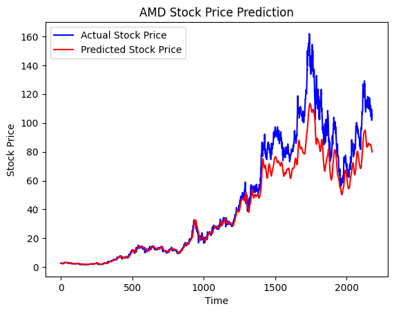
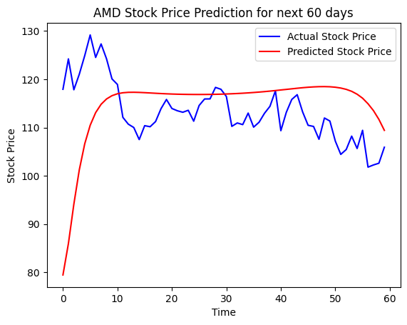
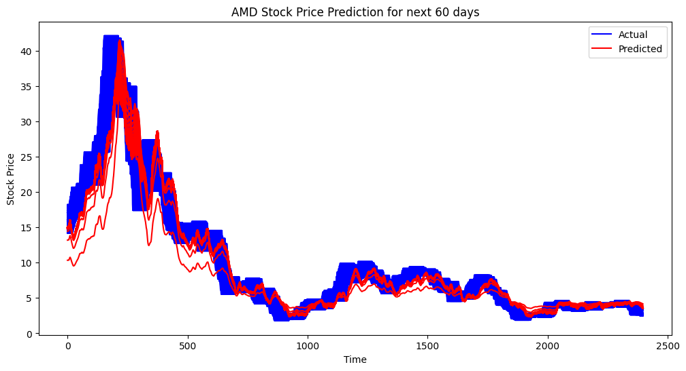

# Time-Series Prediction with Neural Networks

## Table of Contents
- [Time-Series Prediction with Neural Networks](#time-series-prediction-with-neural-networks)
  - [Table of Contents](#table-of-contents)
  - [Summary](#summary)
  - [Results](#results)
    - [Key Graphs](#key-graphs)
    - [Key Metrics](#key-metrics)
  - [Lessons Learned](#lessons-learned)
  - [Future Directions](#future-directions)
  - [Code Documentation](#code-documentation)

## Summary
This project focused on using Neural Networks, specifically LSTMs, to predict stock prices. The primary aim was to understand the capabilities and limitations of using machine learning for time-series prediction.

## Results
- **Successes**: The model was able to capture some underlying patterns in the data and make short-term predictions that align closely with the actual prices.
- **Failures**: The sequence-to-sequence model produced complex and hard-to-interpret results.
  
### Key Graphs
key graphs:

### Key Metrics
- Mean Squared Error was used as the key metric

## Lessons Learned
- Understanding of how LSTMs can capture the underlying patterns in time-series data.
- Insights into the complexities and challenges of predicting stock prices, which are influenced by a multitude of factors.
  
## Future Directions
For the next project, the focus will be on:
- Feature engineering to incorporate more indicators.
- Experimenting with different types of neural networks.
- Trying out ensemble methods to improve prediction accuracy.

## Code Documentation
The code is well-documented and includes comments explaining the major steps, making it easy to follow.

